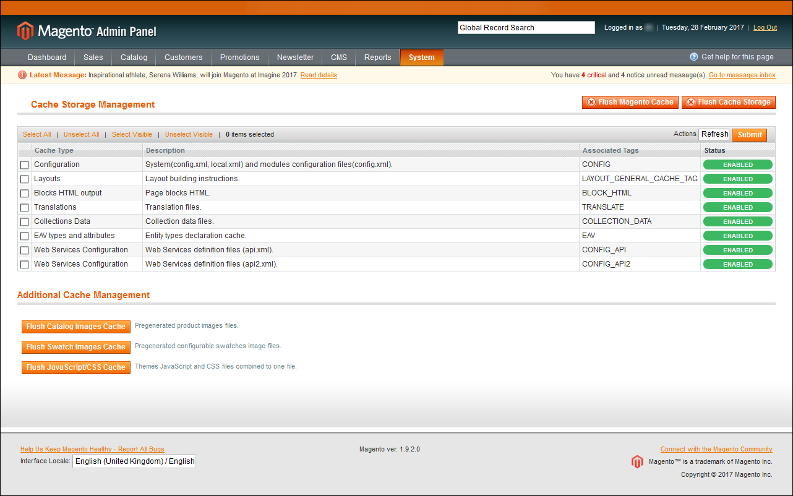
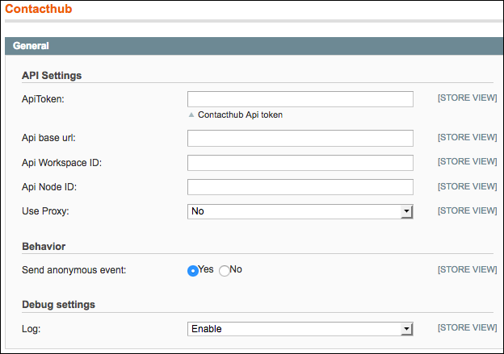

# Contacthub Connect for Magento  
### Version 1.0.0
# Installation and Configuration Guide  

----------

## Table of contents

- [Introduction](#Introduction)  
- [Installing the Magento plug-in](#InstallingPlugIn)  
- [Configuring the Magento plug-in](#ConfiguringPlugIn)
- [Appendix A: Which customer data and activities does the Magento plug-in save in Contacthub?](#AppendixA) 

<a name="Introduction"/>

## Introduction  

The Contacthub Magento plug-in enables you to automatically send all of the activities that your customers undertake on the e-commerce platform to Contacthub, without the need to write any code. The extension automatically collects individual customer information such as:
- The pages they visit
- The products they add to, or remove from, their shopping cart
- The orders they complete

It also ensures potentially valuable information is not lost, by retaining events and actions that are related to customers who have not yet been identified because, for example, they are not logged in, or they have not yet registered. The data is stored by Contacthub, ready to be associated with the customer as soon as they are identified later.

Installing the plug-in is very simple, while configuring it requires just a few minutes.  

<a name="InstallingPlugIn"/>

## Installing the Magento plug-in

To install the plug-in, do the following:  

- Log in to **Magento Admin**, click **System** > **Cache Management** and enable all cache types.  

  

**Cache Management with all cache types enabled**  

- Click **System** > **Tools** > **Compilation** and ensure that **Compiler Status** is set to **Disabled**.  

  

**Compiler Status set to disabled**  

- Establish an FTP/SFTP/SSH connection with your website source folder.  

- Upload all of the folders and files in the extension package to the **root** folder of your Magento installation. 

  

**Example of the Magento root folder**  

**Note:**  

You should ensure that you use the **Merge** upload mode of your client to add the new files, and do not replace any existing folders. While **Merge** is often the default setting of FTP/SFTP clients, you should check to be certain. If you are using MacOS, we recommend that you use **Transmit**.  

If you install several extensions from Amasty, they will contain some files that are the same as those in the Base package. You can overwrite these freely, as they are the system files that are used by all of our extensions.  

- Click **System** > **Cache Management** and then click **Flush Cache Storage**.  

   After you have done this, the extension installation is complete.  

- You can now enable compilation, if you need to do so, under **System** > **Tools** > **Compilation**.  

- Log out of **Magento Admin** and then log back in again, to allow Magento to refresh permissions.  

<a name="ConfiguringPlugIn"/>

## Configuring the Magento plug-in

To configure the plug-in, do the following:  

- Log in to **Magento Admin**, then click **System** > **Configuration**.  

  

**The Magento Admin System options**  

- Click **CONTACTLAB** > **Setup** in the **Magento Configuration** panel, positioned to the left of the screen.  

  

**The Contactlab Setup screen, with the General panel displayed**  

- Click **General** and under **Enable**, select **Yes** to enable the Contactlab module.  

- Under **Days before a task is regarded as obsolete**, enter the appropriate number of days.  

- **Enable debug** if required.  

- If you want to receive error notifications by email, click **Error notification email** and complete the fields.  

  

**The Error notification email panel**  

- Ensure that **Magento Cron** is activated. If not, contact your system administrator.  

- Ensure that you are still in the **System** > **Configuration** section and click **CONTACTLAB** > **Contacthub** in the **Magento Configuration** panel.  

- Click **General** and enter or paste the **APIToken**, **API Workspace ID** and **API Node ID** details in the appropriate fields.  

  

**The Contacthub General settings**  

- Click **Event track** and do the following:  

    - Enable the customer events that you want to trace  

    - Enter a name for the **Newsletter Campaign**  

    - Select whether you want to track **Abandoned Cart events from non-subscribed customers**  

      If you select **No**, Contacthub only tracks Abandoned Cart events for customers who are subscribed to a newsletter.  

    - Enter the **Minimum number of minutes before sending an Abandoned Cart event**  

    - Under **Maximum number of minutes before sending an Abandoned Cart event**, enter the maximum number of minutes that an Abandoned cart event should be tracked.  

      Required to avoid tracking older events.  

  

**The Event track settings**  

- Click **Cron Export Events Settings** and define:

    - The maximum number of events to export, under **Limit events to export**  

    - The export **Frequency**  

    - The number of **Repeats**  
    
 <a name="AppendixA"/> 
 
 # Appendix A: Which customer data and activities does the Magento plug-in save in Contacthub?
 
 ## 1. Customer Profile Data 
 
| Contacthub        | Magento           | Note  |
| :------------- |:-------------| :-----|
| title      | getModel("customer/customer")->getPrefix() |
| firstName      | getModel("customer/customer")->getFirstname()|   
| lastName |getModel("customer/customer")->getLastname() |   
| gender | getModel("customer/customer")->getGender() == 1 ? 'Male' : 'Female'
| dob | date('Y-m-d', strtotime(getModel("customer/customer")->$customer->getDob()))
| locale | getStoreConfig('general/locale/code', $this->getStoreId())
| contacts.email | getIdentityEmail()
| address.street | getModel('customer/address')->getStreet()| adress data loaded from getDefaultBilling() |
| address.city | getModel('customer/address')->getRegion()| adress data loaded from getDefaultBilling() |
| address.country | getModel('directory/country')->load(getModel('customer/address')->getCountry())->getName()| adress data loaded from getDefaultBilling() |
| address.province | getModel('customer/address')->getRegion()| adress data loaded from getDefaultBilling() |
| address.zip | getModel('customer/address')->getPostcode()| adress data loaded from getDefaultBilling() |

## 2. Activities 

| Contacthub                        | Magento           | 
| :------------------------------- |:-----------------------|
| Viewed product                  | When the customer views a product|
| Viewed product category         | When the customer views a product listing belonging to a specific category|
| Added product                   | When the customer adds a product to their shopping cart|
| Removed product                 | When the customer removes a product from their shopping cart|
| Added product to wishlist       | When the customer adds a product to their wishlist|
| Removed product from wishlist   | When the customer removes a product from their wishlist|
| [Order completed](#OrderCompleted)                 | [When the customer completes an order](#OrderCompleted)
| Logged in                       | When the customer logs in to their account|
| Logged out                      | When the customer logs out of their account|
| Subscribed to newsletter        | When the customer subscribes to your newsletter|
| Unsubscribed from newsletter    | When the customer unsubscribes from your newsletter|
| Order shipped                   | When your company ships the products in the order|
| Abandoned cart                  | When the customer added a product to their cart, but did not complete the order/transaction| 

<a name="OrderCompleted"/>

- **Order Completed**

To identify the order data: $order = Mage::getModel('sales/order')->loadByIncrementId($eventData->increment_id) 
To export each single product (item) included in the order: $order->getAllItems() as $item 
To export all the details of each single product (item): $product = Mage::getModel('catalog/product')->load($product_id)

| Contacthub        | Magento           | Note  |
| :------------- |:-------------| :-----|
| Contacthub      |$order->getIncrementId()|
| type      | sale|   
| storeCode |$order->getStoreId()| 
| paymentMethod | Not available  | 
| amount.local.exchangeRate | $order->getStoreToOrderRate()| This is the exchange rate used when the data are loaded|
| amount.local.currency | $order->getOrderCurrencyCode()
| amount.total | $order->getGrandTotal()
| amount.revenue | $order->getGrandTotal() - $order->getShippingAmount() - $order->getShippingTaxAmount()
| amount.shipping | $order->getShippingAmount() + $order->getShippingTaxAmount()
| amount.tax | $order->getTaxAmount()
| amount.discount | $order->getDiscountAmount()
| products.type | sale
| products.id | $product->getEntityId()
| products.sku | $product->getSku()
| product.name | $product->getName()
| products.linkUrl | Mage::getUrl($product->getUrlPath())
| products.imageUrl | Mage::helper('catalog/image')->init($product, 'image')
| products.shortDescription | $product->getShortDescription()
| products.category | $this->getCategoryNamesFromIds($product->getCategoryIds())
| products.price | $item->getPrice()
| products.subtotal | $item->getRowTotal()
| products.quantity | $item->getQtyOrdered()
| products.discount | $item->getDiscountAmount()
| products.tax | $item->getTaxAmount()
| product.coupon | $order->getCouponCode()
| context.store.id | Mage::app()->getStore()->getStoreId()
| context.store.name | Mage::app()->getStore()->getName()
| context.store.country | Mage::getStoreConfig('general/country/default')
| context.store.website | Mage::getUrl('', array('store' => Mage::app()->getStore()->getStoreId()))
| context.store.type | ECOMMERCE 

 **IMPORTANT:** *Any customizations in the Magento track will not be exported and available in Contacthub and these could compromise the plug-in operation.*

----------
